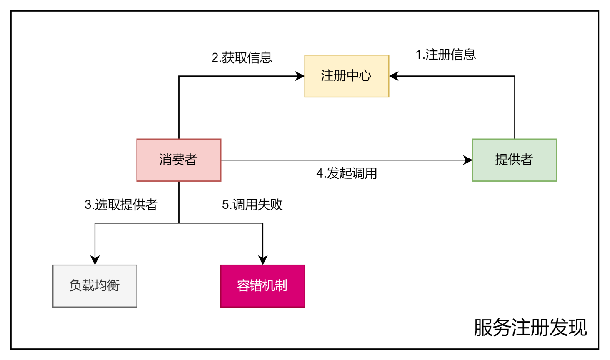

# RPC

## RPC框架

## 服务注册发现

## 存储结构设计

## 消息结构设计

## 消息传递

## 环境

Java version: 11

## 源码目录

* example-common: 示例公共模块
* example-provider: 示例服务提供方
* example-consumer: 示例服务消费方
* qian-rpc-core: RPC核心模块
* qian-rpc-easy: RPC框架简易版

