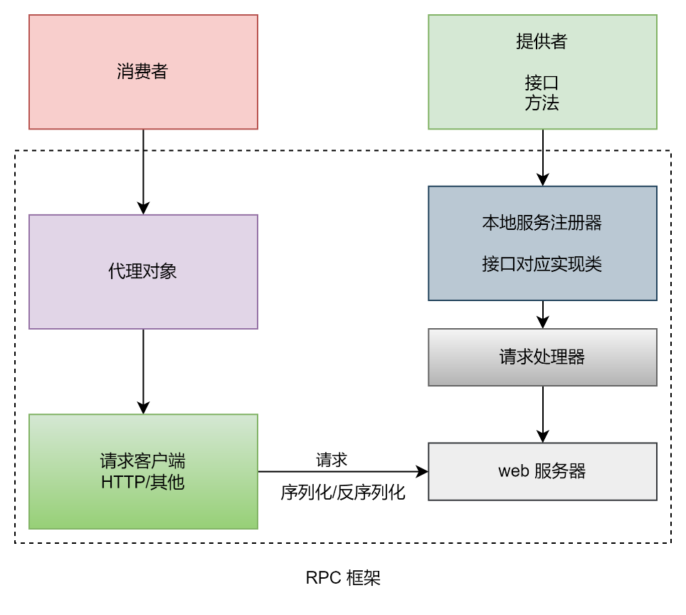

# RPC 框架
> 基于 Java + Etcd + Vert.x 的高性能 RPC 框架
## 项目介绍

这是一款基于 Vert.x + Etcd 实现的轻量级 Java RPC 框架。包括基于 Vert.x 的网络服务器、序列化器、基于 Etcd 和 ZooKeeper 的注册中心、反射、动态代理、自定义网络协议、多种设计模式（单例 / 工厂 / 装饰者等）、负载均衡器设计、重试和容错机制、Spring Boot Starter 注解驱动开发等。

### 环境

> Java version: 11

### 后端

- ⭐️ Vert.x 框架
- ⭐️ Etcd 云原生存储中间件
- ⭐️ ZooKeeper 分布式协调工具
- ⭐️ SPI 机制
- ⭐️ 多种序列化器
  - JSON 序列化
  - Kryo 序列化
  - Hessian 序列化
- ⭐️ 多种设计模式
  - 双检锁单例模式
  - 工厂模式
  - 代理模式
  - 装饰者模式
- ⭐️ Spring Boot Starter 开发
- ⭐️ 反射和注解驱动

### 源码目录

```
qian-rpc
├─qian-rpc-core					: 	RPC核心模块
├─qian-rpc-easy					: 	RPC框架简易版
├─example-common				: 	示例公共模块
├─example-provider				: 	示例服务提供方
├─example-consumer				: 	示例服务消费方
├─qian-rpc-spring-boot-starter	: 	Spring Boot Starter，注解驱动的 RPC 框架
├─example-spring-boot-provider	: 	Spring Boot 示例服务提供方
└─example-spring-boot-consumer	: 	Spring Boot 示例服务消费方
```

### 使用

> 使用请参考示例代码即可。

## 设计

### RPC框架



### 服务注册发现


### 存储结构设计


### 消息结构设计


### 消息传递


